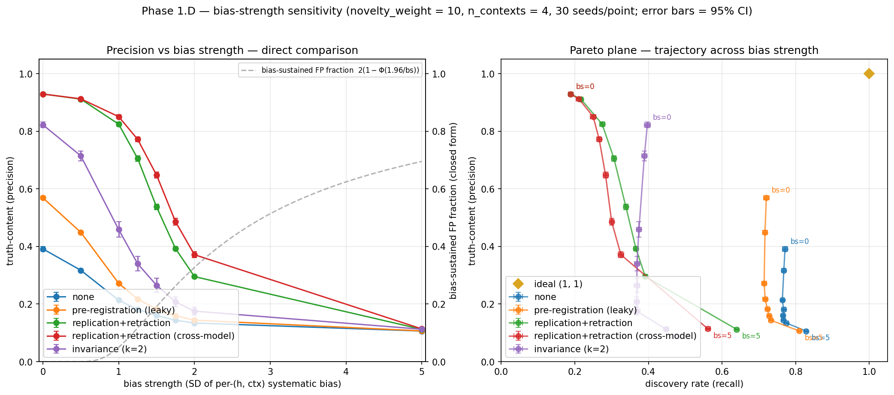

# Example runs

Each section is the most recent result from running the relevant phase's script.
Re-runs overwrite the entry and image in place; git history preserves prior
versions. This is the public face of "what running this produces right now."

---

## Phase 0 — Validity gate

**What was run.** Sweep of the novelty:replication reward ratio across
{1, 2, 5, 10, 20, 50}, holding replication weight at 1.0; 10 seeds per
condition. No mitigations, no correlated errors, parametric agents only.
`n_hypotheses = 10,000` — the "vast hypothesis space, scarce attention"
regime used throughout Phase 1+, so the baseline → mitigations narrative
reads as one continuous experiment.
Script: [`scripts/run_baseline.py`](../scripts/run_baseline.py).

**Result.**

**Interpretation.** Precision falls from 0.50 to 0.39 as the novelty:replication
ratio rises — the replication-crisis dynamic the model is meant to reproduce.
Recall holds at 0.73–0.77 throughout (≈2.25 studies/hypothesis detects most but
not all true effects, at per-study power ~0.71), rising slightly with pressure as
QRP inflates effective α. The Pareto trajectory (right panel) drifts from high-
to low-precision at roughly constant recall — the trade-off, visualised directly.

Validity gate passed: the precision-decline phenomenon appears at non-saturating
recall, licensing the move to mitigations.

---

## Phase 1.C — Mitigation comparison (Pareto plane)

**What was run.** The Phase-0 reward-ratio sweep {1, 2, 5, 10, 20, 50} × seven
mitigation conditions {none, pre-registration (leaky, `qrp_cap=0.1`),
replication+retraction, invariance (k=2/3/4), all-on}; 10 seeds each.
Systematic bias active at `bias_strength = 0.5` (per-(h, ctx) bias SD = 0.5 vs.
unit-variance sampling noise). Same regime as Phase 0 (`n_hypotheses = 10,000`,
≈2.25 studies/hypothesis, `n_contexts = 4` so k=4 is the strictest invariance
bar). Pre-registration is _leaky_ — `qrp_cap = 0.1` allows residual analytic
flexibility, since perfect enforcement is unrealistic.
Script: [`scripts/run_mitigation_comparison.py`](../scripts/run_mitigation_comparison.py).

> **Note on the noise model.** This run uses the corrected additive-bias
> noise model: `Z = δ + bias + private` with `bias ~ N(0, bias_strength²)`
> per (h, ctx) and `private ~ N(0, 1)` per study, both independent and
> additive. An earlier version used a Gaussian-copula formulation
> (`Z = δ + ρ·shared + sqrt(1-ρ²)·private`) which preserved total per-study
> variance at 1 by trading private noise for shared noise as ρ rose. That
> formulation artificially shrank audit-replicate noise at high ρ, giving
> the same-base-model audit (`ReplicationAndRetraction`) an unrealistic
> advantage. The qualitative Pareto-frontier shape below is unchanged from
> the prior run, but absolute precision numbers are 5–10 percentage points
> lower because the corrected model has higher total noise (Var(Z) under H0
> = 1 + bias_strength² = 1.25, not 1).

**Result.**

**Interpretation.** A multi-mitigation Pareto frontier emerges, traced by
both the leaky pre-reg / `none` cluster on the high-recall end and the
invariance strictness gradient (k = 2 → 3 → 4) on the high-precision end:

| Mitigation               | Precision range | Recall range | Position                                                                       |
| ------------------------ | --------------- | ------------ | ------------------------------------------------------------------------------ |
| `none`                   | 0.31–0.40       | 0.74–0.77    | Baseline; QRP-driven precision loss with novelty pressure                      |
| `pre-reg (leaky)`        | ≈ 0.45          | ≈ 0.72       | Pareto-dominates `none` (mild gain in both axes)                               |
| `invariance (k=2)`       | 0.71–0.84       | 0.36–0.39    | **On the frontier** — trades recall for precision                              |
| `replication+retraction` | 0.91–0.94       | ≈ 0.21       | **On the frontier** — audit retracts many TPs given sparse confirming evidence |
| `invariance (k=3)`       | 0.97–0.99       | 0.10–0.11    | **On the frontier** — high precision, low recall                               |
| `invariance (k=4)`       | ≈ 1.00          | ≈ 0.01       | Extreme: publishes almost nothing                                              |
| `all-on`                 | ≈ 1.00          | ≈ 0.04       | Collapses to k=4-like behavior (strictest filter dominates)                    |

**Headline finding: there is no single "best" mitigation; the frontier is
populated by multiple mitigations at different trade-off points.** Pre-reg
gives the most recall-preserving gain. Invariance k=2 buys a large precision
jump for moderate recall cost. Replication+retraction and invariance k=3 sit
between, with invariance k=3 slightly higher in precision. Choice depends on
which end of the frontier matters in deployment.

**Why `none` recall is ~0.75, not 1.0**: at ≈2.25 studies/H and per-study power
~0.71 (without QRP), recall ≈ 1 − exp(−2.25 × power) ≈ 0.75. Bias at
`bias_strength = 0.5` doesn't lower power — it inflates the false-positive rate
via the per-(h, ctx) offset. This is the "moderately-studied effects in a vast
hypothesis space" regime where the replication-crisis dynamic is interpretable.

**Why high-k invariance publishes so little**: at ≈2.25 studies/H over 4
contexts, each H reaches only ≈1.85 distinct contexts (coupon-collector), so
k=2/3/4 catch ~38%/~11%/~1% of true H. **A real finding, not an artifact:
strict invariance is data-hungry** — it works where attention concentrates
(well-studied topics), not on the long tail. The non-uniform-attention upgrade
that models this is tracked in [FUTURE_WORK.md](../FUTURE_WORK.md).

**Why `all-on` collapses to k=4-like behavior**: the strictest filter in the
stack dominates. Once k = 3 invariance is in place, it gates publication so
strictly that adding pre-reg and audit changes little.

**Phase 1.D** below tests this directly.

---

## Phase 1.D — Bias-strength sensitivity

**What was run.** Sweep of `bias_strength` across {0, 0.5, 1.0, 2.0, 5.0}
at fixed `novelty_weight = 10`, over four mitigations: `none`,
`pre-registration (leaky, qrp_cap=0.1)`, `replication+retraction
(audit_fraction=0.1)`, and `invariance (k=2)`. 10 seeds per condition. Same
regime as Phase 1.C (n_hypotheses=10000, n_contexts=4, n_steps=500, uniform
hypothesis selection). High-k invariance (k=3, k=4) was excluded — Phase 1.C
established they publish almost nothing in this sparse-attention regime.
The sweep range was extended to bs=5 to probe whether strong enough bias
correlation defeats the same-base R+R audit (intraclass correlation between
same-(h, ctx) studies = bias_strength² / (1+bias_strength²): bs=2 → 0.80,
bs=5 → 0.96). The mapping from these correlation values to any real system
(e.g. "same-LLM near-deterministic") is illustrative, not measured.
Script: [`scripts/run_bias_sensitivity.py`](../scripts/run_bias_sensitivity.py).

**The claim Phase 1.D is positioned to test.** _Invariance-style mitigations
dominate audit-style ones under sufficiently strong systematic bias._
Mechanism: same-base audits inherit the per-(h, ctx) bias that drove the
original significance, so a lucky-bias FP gets confirmed by audit;
invariance requires findings across distinct contexts, each with an
independent bias draw, so a single lucky bias cannot carry an FP through.

**Result.**

| bias_strength | `none` | `pre-reg (leaky)` | `replication+retraction` | `invariance (k=2)` |
| --- | --- | --- | --- | --- |
| 0.0  | 0.39 / 0.77 | 0.57 / 0.72 | 0.93 / 0.19 | 0.82 / 0.40 |
| 0.5  | 0.32 / 0.77 | 0.45 / 0.72 | 0.91 / 0.22 | 0.72 / 0.39 |
| 1.0  | 0.21 / 0.76 | 0.27 / 0.71 | 0.82 / 0.27 | 0.46 / 0.37 |
| 1.25 | 0.18 / 0.77 | 0.22 / 0.72 | 0.71 / 0.31 | 0.34 / 0.37 |
| 1.5  | 0.16 / 0.77 | 0.18 / 0.72 | 0.54 / 0.34 | 0.27 / 0.37 |
| 1.75 | 0.14 / 0.77 | 0.16 / 0.73 | 0.39 / 0.37 | 0.21 / 0.37 |
| 2.0  | 0.13 / 0.77 | 0.14 / 0.73 | 0.30 / 0.39 | 0.18 / 0.37 |
| 5.0  | 0.11 / 0.83 | 0.11 / 0.81 | 0.11 / 0.64 | 0.11 / 0.45 |

_(precision / recall per cell; 30 seeds, 95% CIs ≈ ±0.005–0.03 on precision — see FINDINGS.md Finding 3 for the R+R column with explicit CIs. Read the R+R column top-to-bottom for the smooth 1→2 descent. The figure also plots a fifth curve — R+R with a *cross-model* auditor — compared just below.)_

**Cross-model audit — a partial fix.** Swap the same-base auditor (which reuses the original's
bias) for a *different* model (the auditor draws its own independent per-(h, ctx) bias). It
recovers precision where same-base audit fails — but only partially:

| bias_strength | same-base R+R | cross-model R+R | lift |
|---|---|---|---|
| 1.0  | 0.83 | 0.85 | +0.03 |
| 1.25 | 0.71 | 0.77 | +0.07 |
| 1.5  | 0.54 | 0.65 | **+0.11** |
| 1.75 | 0.39 | 0.49 | +0.09 |
| 2.0  | 0.30 | 0.37 | +0.08 |
| 5.0  | 0.11 | 0.11 | ~0 |

_(precision; 30 seeds, CIs ≈ ±0.01.)_ Independence breaks the *exact* bias-inheritance that dooms
same-base audit, so the cross-model auditor retracts bias-driven FPs the same-base one confirms —
but a different model is still a model, with its own independent bias, so it re-confirms some FPs
by *its* bias and the recovery is partial. At extreme bias the auditor is as overwhelmed as the
original → no lift. The cleaner the auditor's independence (and the lower its own bias), the more
it recovers; at the limit you fix the model, not the audit (Finding 8). See FINDINGS Finding 9.

**Where the data points.** Two distinct dynamics show up across the
extended range, neither of which is the predicted invariance-overtakes-R+R
crossover:

1. **R+R precision falls steeply but smoothly through the 1→2 window.** Densely
   sampled at 30 seeds, precision descends monotonically (0.82 → 0.71 → 0.54 → 0.39 →
   0.30) and tracks the closed-form normal-tail driver `P(|bias| > z_crit) =
   2(1−Φ(1.96/bs))` — a steep transition, not a discontinuity. The mechanism is as the
   project intuited: at high correlation the audit replicate inherits a per-(h, ctx)
   bias large enough on its own to drive significance, so the fresh-private-noise trick
   no longer suffices to retract lucky-bias FPs. **R+R is regime-specific, not
   unconditionally robust.**

2. **Invariance(k=2) collapses faster than R+R across the entire range.**
   At every bias_strength tested, R+R precision ≥ invariance(k=2)
   precision. They converge at bs=5 (both at 0.11, approximately the
   `none` precision floor) — the predicted crossover does not occur at
   k=2. The multi-context filter at minimum-k is structurally too
   permissive to catch lucky-bias-in-2-of-4-contexts FPs at any tested bias.

3. **At extreme bias (bs=5), all mitigations converge to the `none`
   precision floor (~0.11)**, but only `none` preserves recall (0.83 vs.
   R+R 0.64 vs. invariance 0.44). At this regime, `none` actually
   Pareto-dominates all the mitigations — _they buy nothing at the cost of
   recall_.

**k=2 invariance is not the version of the claim that matters here** — the
natural next test is _strict_ invariance (k → n_contexts) under a regime
where it has the data to function. That test isn't possible under the
current uniform-attention model: at ~2.25 studies/H, k=3 catches ~11% of
true H and k=4 catches ~2% — too few findings to compare meaningfully
against R+R. Phase 2's non-uniform-attention upgrade is the prerequisite
for running it.

**Where this points next**:

1. **Phase 2 — non-uniform hypothesis selection** ([FUTURE_WORK.md](../FUTURE_WORK.md)). The
   prerequisite for testing high-k invariance. Under power-law attention,
   heavily-studied H accumulate the multi-context coverage that lets k=3,
   k=4 invariance actually filter; the long tail keeps `none` recall
   meaningful. This unlocks the _real_ invariance vs. R+R comparison at
   the regime (bs ≥ 2) where R+R has just been shown to break.

2. **Phase 2.B — cross-base audit comparison**. A small extension to
   `ReplicationAndRetraction` (one boolean parameter) that draws a fresh
   bias per audit instead of inheriting the (h, ctx) bias. With the
   same-base R+R transition now mapped across the 1→2 window, the
   directly-actionable question is whether cross-base
   audit pushes the transition to higher bias or eliminates it. If yes, the alignment-relevant
   recommendation is "use cross-base audit when expected bias > some
   threshold." If no, cross-base audit doesn't help and the recommendation
   shifts to invariance.

3. **The "useful band" framing.** Each mitigation appears to be effective
   in a narrow range of bias_strengths. Below: not needed (precision is
   acceptable without intervention). Above: not effective (precision
   collapses regardless). The bands for each mitigation are worth
   characterizing explicitly — that's the actionable artifact for
   real-world governance.

4. **Sensitivity sweeps within each mitigation**. `audit_fraction`,
   `audit_sample_size`, `k_contexts` × `n_contexts` joint sweeps — to map
   the parameter space rather than test single points.

**One observation to carry forward**: pre-registration (leaky) does _not_
defend against bias-driven FPs in this model — its QRP lift over `none` is
largest at low bias and converges to zero as bias dominates (both hit the
~0.11 floor). Pre-reg addresses one source of inflated significance (QRP);
bias is a separate source; pre-reg doesn't touch it. This suggests a useful refinement to the
mitigation taxonomy: distinguish _source-of-error_ mitigations (pre-reg ↔
QRP, audit ↔ random per-study noise, invariance ↔ per-context bias) and
expect each to address only its corresponding noise source.

**Contrast with the broken-noise-model run** (preserved here as a record of
what the model-fix changed): the prior Phase 1.D showed R+R precision
_staying flat_ and recall rising sharply with the old ρ parameter — an
artifact of the Gaussian-copula form shrinking audit private noise at
high ρ. Under the corrected additive-bias model, R+R precision _does_ fall
with bias (modestly) and recall rises (modestly) — both effects are real
but smaller than the artifact made them look. The diagnostic value of the
fix: it changed what we _thought_ the answer was, and revealed what the
actual model says.
