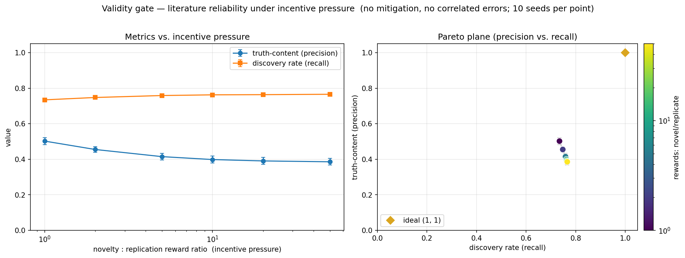
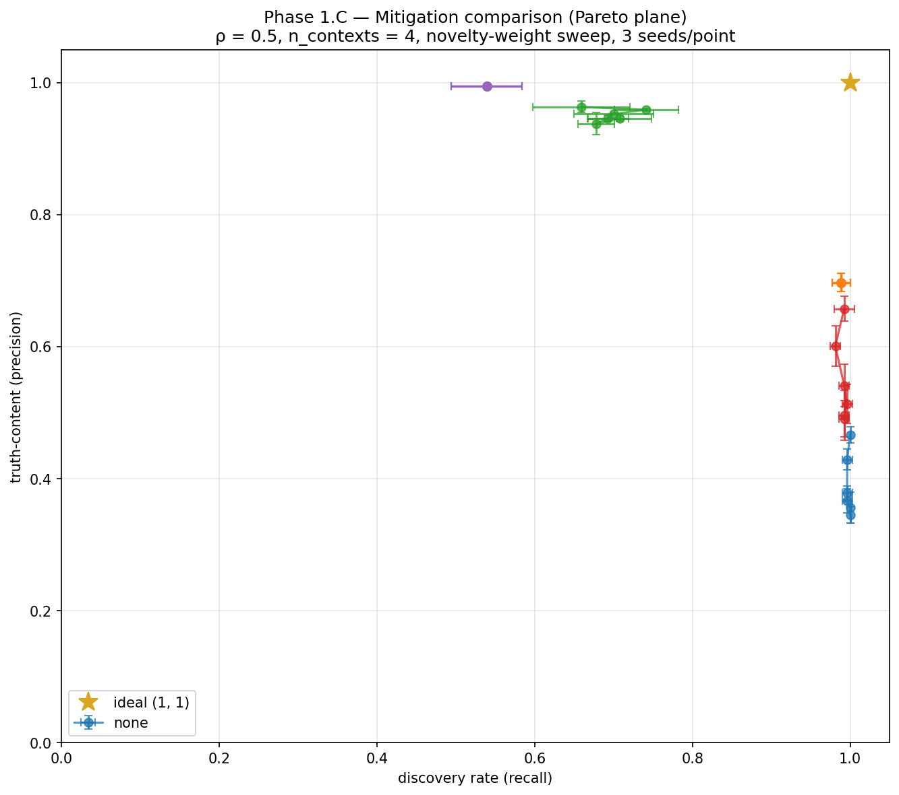

# example-runs

Each section is the **latest** result from running the relevant phase's script.
Re-runs overwrite the entry and image in place; git history preserves prior
versions. This is the public face of "what running this produces right now."

---

## Phase 0 — Validity gate

**What was run.** Sweep of the novelty:replication reward ratio across
{1, 2, 5, 10, 20, 50}, holding replication weight at 1.0; 3 seeds per
condition. No mitigations, no correlated errors, parametric agents only.
Script: [`scripts/run_baseline.py`](../scripts/run_baseline.py).

**Result.**

**Interpretation.** Truth-content (precision) falls as the novelty:replication
ratio rises — the qualitative replication-crisis dynamic the model is meant to
reproduce. Discovery rate (recall) stays saturated near 1.0: with 50 agents
over 500 steps, every true hypothesis gets studied enough times that at least
one significant result lands eventually, so the standing literature catches
them all. The Pareto-plane trajectory drifts from the upper-right toward the
lower-right as pressure increases — same data, the precision–recall trade-off
visualised directly.

Validity gate passed: the engine produces the known phenomenon under the
simplest configuration, licensing the work to proceed to mitigations.

---

## Phase 1.C — Mitigation comparison (Pareto plane)

**What was run.** Sweep of the novelty:replication reward ratio across
{1, 2, 5, 10, 20, 50} × {no mitigation, pre-registration,
replication+retraction, invariance (k=2), all-on}; 3 seeds per condition.
Correlated errors active at ρ = 0.5 (moderate); n_contexts = 4 to give
the invariance mitigation room to operate.
Script: [`scripts/run_mitigation_comparison.py`](../scripts/run_mitigation_comparison.py).

**Result.**

**Interpretation.** Three mitigations sit on the Pareto frontier, each with a
different precision–recall trade-off:

- **Pre-registration** (precision ≈ 0.70, recall ≈ 0.99, *flat across pressure*) —
  kills QRP at the source, so incentive pressure no longer matters; the
  trajectory collapses to a single point. Best when high recall matters.
- **Replication + retraction** (precision ≈ 0.94, recall ≈ 0.70) — audit-and-prune
  trims false positives aggressively but at recall cost.
- **All-on** (precision ≈ 0.99, recall ≈ 0.54) — also pressure-invariant for the
  same reason as pre-reg; precision approaches the ceiling but recall takes a
  further hit from the audit on top of the pre-reg recall loss.

Two mitigations are Pareto-*dominated* at this ρ:

- **No mitigation** (precision 0.35–0.47, recall ≈ 1.0) — every mitigation beats it.
- **Invariance (k = 2)** alone (precision 0.49–0.66, recall ≈ 0.99) — improves
  modestly over no mitigation but doesn't outperform pre-registration. At
  ρ = 0.5, k = 2 is evidently not strict enough to consistently break through
  correlated-error false positives. The project's deeper claim — *invariance
  dominates replication-style mitigations under sufficiently strong correlated
  errors* — is regime-specific and warrants the **ρ-sweep planned for Phase 1.D**:
  if invariance's advantage exists it should emerge at higher ρ and/or higher k.

Note that **all-on does not strictly dominate every single mitigation** —
mechanistically real: pre-reg eliminates the pressure dynamic by killing QRP,
so adding the replication audit on top starts retracting true positives that
just-barely cleared α, which costs recall.
